# Stress relief- quotes - Progressive Web Apps 
Design quotes is een applicatie voor studenten die opzoek zijn naar inspirerende design citaten om in hun werk te gebruiken. De applicatie heeft een lijst met citaten van verschillende beroemde developers en ontwerpers. Elke citaat bestaat uit de auteur van de citaat, een biografie van de auteur, een foto van de auteur zelf. Dit concept was bedacht het vak Web App From Scratch. Het is client-side applicatie gemaakt met HTML, javascript en CSS. Voor dit vak heb ik de app omgezet in een installeerbare web App. Het is volledige gemaakt met server-side javascript, Express.js, EJS template engine en service Worker. 


### Link naar de DEMO
[Design Quote App](https://pwa-quotes-app-production.up.railway.app/)

---

# Inhoud
- [Applicatie installeren](https://github.com/K3A101/PWA-quotes-app#applicatie-installeren)
- [Node en NPM installeren](https://github.com/K3A101/PWA-quotes-app#npm-en-nodejs-installeren)
- [NPM package installeren](https://github.com/K3A101/PWA-quotes-app#npm-package-installeren)
- [Applicatie gebruiken](https://github.com/K3A101/PWA-quotes-app#applicatie-gebruiken)
- [Express Server maken](https://github.com/K3A101/PWA-quotes-app#express-server-maken)
- [Routing](https://github.com/K3A101/PWA-quotes-app#basic-routing)
- [Template Engine](https://github.com/K3A101/PWA-quotes-app#template-engine)
- [Routes Bestand](https://github.com/K3A101/PWA-quotes-app#routes-bestand)
  - [Homepagina](https://github.com/K3A101/PWA-quotes-app#homepagina)
  - [Overzichtpagina](https://github.com/K3A101/PWA-quotes-app#overzichtpagina)
  - [Detailpagina](https://github.com/K3A101/PWA-quotes-app#versie-2-detailpagina)
  - [Aboutpagina](https://github.com/K3A101/PWA-quotes-app#aboutpagina)
  - [Build Tools](https://github.com/K3A101/PWA-quotes-app#build-tools)
- [Maak de webapplicatie een progressive web App](https://github.com/K3A101/PWA-quotes-app#maak-de-applicatie-een-progressive-web-app)
- [Hoe maak ik de App installeerbaar](https://github.com/K3A101/PWA-quotes-app#hoe-maak-ik-de-app-een-pwa-installeerbaar)
- [Manifest.json](https://github.com/K3A101/PWA-quotes-app#manifestjson)
- [Service worker](https://github.com/K3A101/PWA-quotes-app#service-worker)
- [How werkt de service worker](https://github.com/K3A101/PWA-quotes-app#hoe-werkt-de-service-worker)
- [Activity Diagram van Service worker](https://github.com/K3A101/PWA-quotes-app#activity-diagram-van-de-service-worker)
- [Critical Rendering Path](https://github.com/K3A101/PWA-quotes-app#critical-rendering-path)
- [Hoe heb ik de critical rendering path beter gemaakt?](https://github.com/K3A101/PWA-quotes-app#hoe-heb-ik-de-critical-rendering-path-beter-gemaakt)
- [Applicatie online zetten](https://github.com/K3A101/PWA-quotes-app#applicatie-online-zetten)
---

## Applicatie installeren
Wat heb je nodig:
- npm
- nodejs
- express
- Template engine ejs

### NPM en Node.js installeren
Om de server te installeren heb ik node en express gebruikt. Dat doe ik met `nvm`. Nvm is package installer waar je verschillende packages kan installeren. Hiermee heb ik de laatste versie van npm en node geïnstalleerd. 

#### 1. nvm installeren
```
nvm install 19.8.1
```
Als je deze commando in je terminal intoets dan installeer je de laatste versie van npm en node.js. Je moet ervoor zorgen dat je ze allemaal installeer in je root van je app betandmap.

#### 2. Versie bekijken
Om  te kijken of je de juiste versie hebt moet je achter de pakketnaam een -v toevoegen. 
```
node -v
<!-- Output -->
<!-- v19.8.1  -->
```
    npm -v
    <!-- Output -->
    <!-- 9.5.1 -->

### NPM Package installeren
#### Package.json opzetten
Om een package.json te installeren gebruik je de commando `npm init`. Als output krijg je aantal vragen die je moet invullen. Zoals de naam van de applicatie, maker van de applicatie, applicatie versie, licentie, repo, geïnstalleerde npm packages etc. Hieronder ziet u een voorbeeld van wat er staat in mijn package.json bestand.

```json
{
  "name": "pwa-quotes-app",
  "version": "1.0.0",
  "description": "Stress relief quotes app is een app waar je citaten van verschillende beromende mensen in het wereld van de web.",
  "main": "app.js",
  "directories": {
    "doc": "docs",
    "example": "examples"
  },
  "scripts": {
    "start": "node app.js",
    "dev": "nodemon app.js",
    "minify:server": "uglifyjs app.js -c -m -o app.min.js",
    "minify:routerFolder": "uglifyjs-folder ./routes -eo ./routes-output",
    "minify:routerOne": "uglifyjs-folder ./routes -o ./routes-output/routes.min.js",
    "minify:js": "uglifyjs-folder ./public/script -eo ./public/script-output/clientside.min.js"
  },
  "repository": {
    "type": "git",
    "url": "git+https://github.com/K3A101/PWA-quotes-app.git"
  },
  "keywords": [
    "quotes"
  ],
  "author": "Keïsha Alexander",
  "license": "MIT",
  "bugs": {
    "url": "https://github.com/K3A101/PWA-quotes-app/issues"
  },
  "homepage": "https://github.com/K3A101/PWA-quotes-app#readme",
  "dependencies": {
    "axios": "^1.3.4",
    "ejs": "^3.1.9",
    "express": "^4.18.2",
    "express-minify-html": "^0.12.0",
    "request": "^2.88.2"
  },
  "devDependencies": {
    "nodemon": "^2.0.21",
    "sass": "^1.59.3",
    "uglify-js": "^3.17.4",
    "uglifyjs-folder": "^3.2.0"
  }
}

```

### Benodige packages installeren
Tot nu toe heb ik express, nodemon, ejs en body-parser geïnstalleerd.
Als je een functionaliteit wilt toevoegen, heb ik npm registery gebruikt, daar vind je verschillende packages die je in je app kan gebruiken. Ik heb verschillende packages geïnstalleerd. Om ze te kunnen bekijken, kun je in mijn package.json gaan spieken. 
Om paketten te installeren gebruik je de volgende commando:

    npm install express
    <!-- npm install <package-name> -->

## Applicatie gebruiken
Hier is een korte stappenplan hoe je mijn project kan gebruiken in je eigen Dev Environment.

### Repository Clonen
Het eerste wat je moet doen is deze repository forken. Dan kun je deze bestandstructuur gebruiken.
    
    git clone https://github.com/K3A101/PWA-quotes-app.git


### Npm install

Als de applicatie eenmaal klaar is en je wilt hem gebruiken dan moet je alleen `npm install` gebruiken. Alle packages binnen  mijn  app en `package.json` worden automatisch geïnstalleerd.


### Server starten
Om de server te starten en live demo te bekijken moet je een van deze commando's onderaan uitvoeren:

    npm run dev
    <!-- nodemon app.js -->
          of
    npm run start
    <!-- node app.js -->

---

## Express Server maken
### Express installeren
Voor de App heb ik een server gemaakt met de Express.js library. Express is een backend web applicatie framework van Node.js. Hiermee kan je een server side applicatie maken met alleen javascript. Om Express te gebruik heb ik eerst geïnstalleerd met npm. Hetzelfde commando heb ik gebruikt.


    npm install express

Verder heb ik een `app.js `bestand gemaakt. In de app.js bestand had ik mijn express server ingericht. 

### Express importeren
Ten eerste heb ik express geïmporteerd met de `require()` methode. 

```javascript
// app.js
const express = require('express');
const app = express();
const port = 5000;
```

## Basic routing
Verder heb ik een routing toegevoegd voor alle pagina's van de app. De pagina wordt weergegeven met de bijbehorende URL endpoints. Het is een request om de url op te halen vanuit de server. Wanneer de server de URL vind, wordt de pagina gestuurd naar de client met een templating engine. Hier is de structuur van een server-side routing.

    app.METHOD(PATH, HANDLER)

1. app is een instantie van express
2. Method is een HTTP request methode ( POST, GET, PUT, DELETE)
3. Path is een pad van de server
4. Handler is een functie die uitgevoerd wordt als de route overeenkomen

### Routing in design quotes app

```javascript
// app.js
// Home pagina
app.get('/', (req, res) => {
    res.render("index")
    // res.send('Hello World!!!')
})

// About pagina
app.get('/about', (req, res) => {
    res.render("about")
    // res.send('Hello World!!!')
})


```
Deze stukje bovenop is een get request van de Homepagina en de Aboutpagina. Om bijvoorbeeld de aboutpagina te bereiken moet je aan het eind van het domein `/about`zetten. Daarna wordt de pagina weergegeven met `res.render()`. De waarde is de EJS bestand. Dat de template engine die ik heb gebruikt. 


### Server starten op localhost
Om de server te starten heb ik de `app.listen()`methode gebruikt. Ik heb eerst een variabele `const port: 5000;` gemaakt.  En als argument in de functie gezet. Dus als ik de server wil starten gebruik ik deze link: [ http://localhost:5000](http://localhost:5000).

```javascript
// app.js
app.listen(port, () => {
    console.log(`Example app listening on  http://localhost:${port}`)
})
```

#### Nodemon
Om het makkelijk te maken voor mezelf heb ik een package geïnstalleerd waar ik de server kan verversen. Daarmee hoeft ik niet elke keer de server starten met `node app.js`

### Npm scripts
In mijn package.json bestand is er een onderdeel met scripts. NPM scripts zijn zelf gemaakte npm commando's die je aan de terminal kan geven om bepaalde taken uit te kunnen voeren.
Ik heb eem npm script gemaakt waar ik de server kan starten. Ik heb een script die het server start. In de terminal voer je deze commando in: `npm start` of `npm run start`. Om de server te starten met Nodemon gebruik je deze script: `npm run dev`.

```json
// package.json
 "scripts": {
    "start": "node app.js",
    "dev":"nodemon app.js"
  },
```

### Package in het server importeren
Als je een npm package importeert dan moet je de `app.use()` methode gebruiken. Hier is een voorbeeld dat laat zien hoe dat allemaal gebeurd.  Hier heb ik `express-minify-html` geïnstalleerd. Eerst de minifyHRML importeren met `require()` en deze in variabele opslaan. Verder `app.use()`gebruiken om de package in het server te gebruiken.

```javascript
const minifyHTML = require('express-minify-html');
 app.use(minifyHTML({
    override: true,
    exception_url: false,
    htmlMinifier: {
        removeComments: true,
        collapseWhitespace: true,
        collapseBooleanAttributes: true,
        removeAttributeQuotes: true,
        removeEmptyAttributes: true,
        minifyJS: true
    }
}));
```
Je kan met de `put()` methode je eigen componenten in de server importeren. Ik heb een aparte bestand gemaakt voor mijn routes en daarna het betsand importeren met de path naar het bestand.

```javascript
// Installeer de route betsand in de server
var quotesRouter = require('./routes/quotes');
//An express zeggen om quotes.js bestand te gebruiken voor quotes router
app.use('/', quotesRouter);

```

---
## Template engine
Een templating engine zorgt ervoor dat je statische pagina's kun weergeven via de server. Dus je kan bijvoorbeeld je html, css en afbeelding naar de server sturen en dan weer opvragen. Je kan uit verschillende engine kiezen en gebruiken. Ik heb EJS template engine gebruikt. 


### EJS installeren
Het eerste wat je moet doen is ejs installeren met npm
   
    npm install ejs

### Templating ejs in de server toevoegen
In de server moet je aangeven welke templating engine je gaat gebruiken. Je gebruikt de `app.set()` methode.

    app.set('view engine', 'ejs');


### Views bestandmap maken
Daarna maak je een views bestandmap. Hierin komt al je ejs pagina's van je applicaties. 


### Statisch bestanden
Statisch bestanden zijn je css stylesheets, client-side javascript en je afbeeldingen. Om deze bestanden via de server op te halen. Moet je de `static` express middleware gebruiken. Ik heb in mijn applicatie een `public/` bestandmap gemaakt. Daarin heb ik mijn css stylesheets, manifest.json, service worker en mijn afbeeldingen.

#### Public bestandmap toveoegen in de server
Om mijn pagina te stijlen me de css heb ik de public bestandmap toegevoegd met de static express middleware. Hieronder kun je zien hoe het werkt.

```javascript
//Gebruikt de public folder
app.use(express.static('public'))
```

### Volledige code in app.js bestand

```javascript
// Express importeren
const express = require('express');

//Nieuwe server aanmaken
const app = express();
const port = 5000;
const path = require("path");
let options = { maxAge: '2y' }
const minifyHTML = require('express-minify-html');

// Setup de template engine ejs
app.set("views", path.join(__dirname, "views"));
app.set('view engine', 'ejs');


//Gebruikt de public folder
app.use(express.static('public', options))


// Installeer de route betsand in de server
var quotesRouter = require('./routes/quotes');
//An express zeggen om quotes.js bestand te gebruiken voor quotes router
app.use('/', quotesRouter);

app.use(minifyHTML({
    override: true,
    exception_url: false,
    htmlMinifier: {
        removeComments: true,
        collapseWhitespace: true,
        collapseBooleanAttributes: true,
        removeAttributeQuotes: true,
        removeEmptyAttributes: true,
        minifyJS: true
    }
}));

// Server gehost op port 5000
app.listen(port, () => {
    console.log(`Example app listening on  http://localhost:${port}`)
})
```
---
## Routes bestand
Ik heb mijn routes/URL endpoints request functies in een aparte bestand gemaakt. Ik heb mijn app.js bestand een een beetje aangepast. Mijn applicatie bestaat uit:
- Homepagina met een link naar de homepagina
- Overzichtpagina met alle quotes
- Detailpagina  per quotes
- Aboutpagina

Alle pagina hebben een eigen routes url. De routes is te vinden in de bestandmap `routes/quotes.js`. 


### In de quotes bestand

In quotes.js staat al de routes url voor mijn applicatie. Ik heb ten eerste een express router instantie gemaakt en de URL daaraan gekoppeld. Ik heb verder de request package die ik heb gedownload met npm in deze bestand geïmporteerd. Hiermee kan ik wat doen met de API url. Het lijkt als de fetch() functie van client-side javascript.
```javascript
const express = require('express');
const request = require('request');
const router = express.Router()
```

### Routes url
Verder heb ik per pagina een url gegeven met de `router.get()` methode. 

### Homepagina
In mijn homepagina is de route een `/` slash dus de root. Dus ik ga een request doen naar de data van de API en wordt gerendered op de index.ejs template pagina.
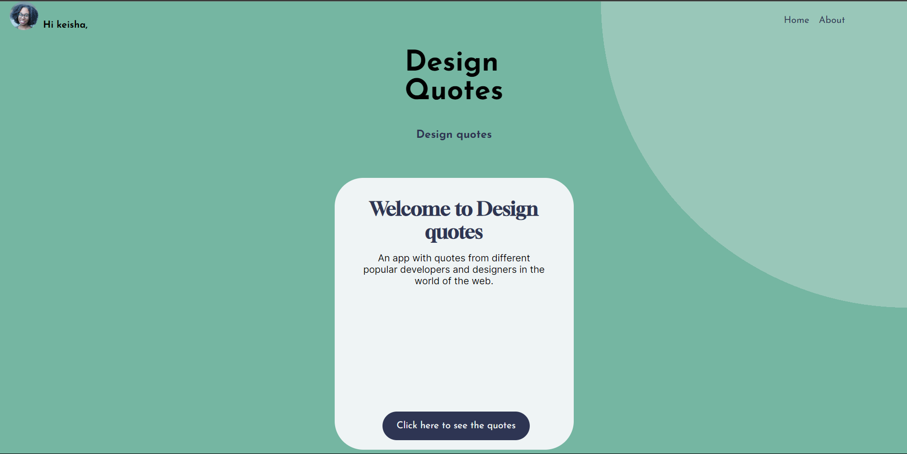

```javascript
// /routes/quotes.js
// Homepagina
 const API_URL = `https://opensheet.elk.sh/14joQ9h8M0ydoJJ-fNYN68ls3TWPCvk8ZvBJvUXpF1cQ/sheet1/`

router.get('/', (req, res) => {
    request(API_URL, { json: true }, (err, requestRes, body) => {
        if (err) {
            // We got an error
            res.send(err);
        } else {
            res.render('index', {
                title: 'Home',
                pageTitle: 'Design quotes'

            });
        }
    })
})

```

```html
<!-- /views/index.ejs -->
    <section id="home">
            <article>
                <h2>Welcome to Design quotes</h2>
                <p>An app with quotes from different pupular developers and designers in the world of the web.</p>
                
                <a href="/quotes"> Click here to see the quotes</a>
            </article>
        </section>
```


### Overzichtpagina
In de overzichtpagina is de route een `/quotes`. Deze pagina heeft een lijst van alle quotes die te vinden zijn in de API. Alle data wordt gerendered in de `quotes.ejs` bestand. Ik heb het een forEach loop gebruikt om alle die data te weergeven. 
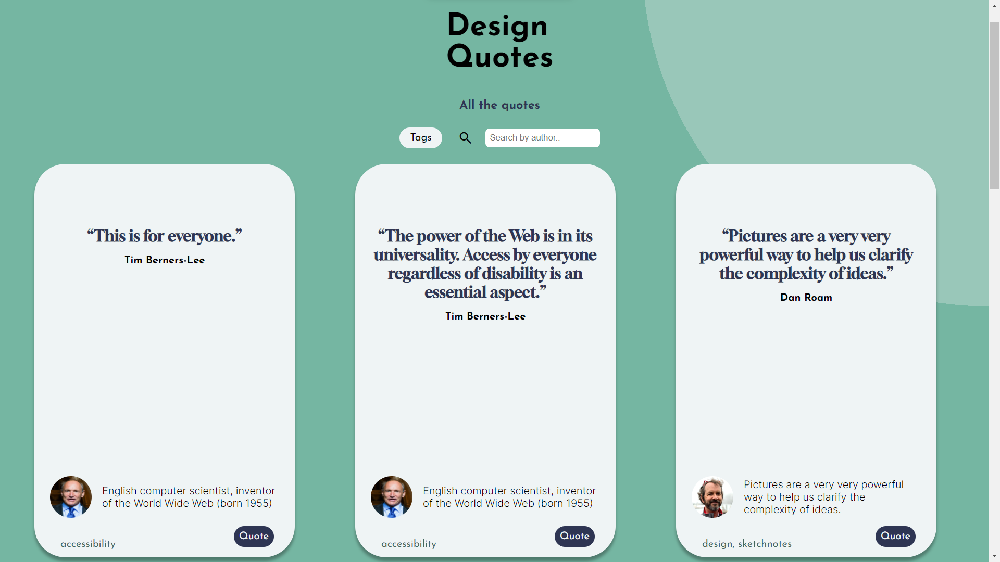

```javascript
// /routes/quotes.js
// Overzichtpagina
 const API_URL = `https://opensheet.elk.sh/14joQ9h8M0ydoJJ-fNYN68ls3TWPCvk8ZvBJvUXpF1cQ/sheet1/`

router.get('/quotes', (req, res) => {
    request(API_URL, { json: true }, (err, requestRes, body) => {
        if (err) {
            // We got an error
            res.send(err);
        } else {

            // Render the page using the 'quotes' view and our body data
            res.render('quotes', {
                title: 'Quotes', // We use this for the page title, see views/partials/head.ejs
                pageTitle: 'All the quotes',
                quoteData: body
            });
        }
    })
})


```
```html
<!-- /views/quotes.ejs -->
     <section id="content">
                    <% quoteData.forEach((item)=> { %>
                        <article>
                        <section>
                            <q><%-item.quote%></q>

                            <p class="author"><%-item.author%></p>
                        </section>
                        <section>
                            " alt="Avatar">
                            <p><%-item.bio%></p>
                        </section>
                        <ul>
                            <a href="/quotes/<%-item.id%>">Quote<%-item.id%></a>
                            <li><%-item.tags%></li>
                        </ul>
                    </article> 
                    <%})%>
                   
                </section>

```

### Detailpagina versie 1
In de detailpagina  is de route een `/qoutes/:id`. Dit betekent de ID per quotes staat in de url. Dus als je  de link klikt via een van de quotes in de overzichtpaginas. Dan ga je naar de detailpagina van die ene quote. 

```javascript
router.get('/quotes/:id', function (req, res) {
    request(`https://opensheet.elk.sh/14joQ9h8M0ydoJJ-fNYN68ls3TWPCvk8ZvBJvUXpF1cQ/sheet1/quotes/${req.params.id}`, { json: true }, function (err, requestRes, body) {
        if (err) {
            // We got an error
            res.send(err);
        } else {
            // Render the page using the 'quote' view and our body data
            res.render('quote', {
                title: `Quote ${req.params.id}`,
                pageTitle: `Quote ${req.params.id}`,
                quoteData: body.quote
            });
        }
    });
});
```

### Versie 2: Detailpagina
Ik heb een iteratie gemaakt aan mijn detailpagina. Met de package `request` was het niet mogelijk om een detailpagina te maken op basis van de Id. Want het was een beperking met mij API. Ik heb daardoor een andere pakket gebruikt. Die heet __axios__. Axios lijkt bijna hetzelfde als de fetch API in het client-side. 
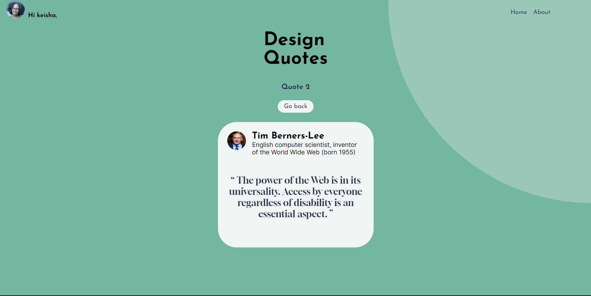

Ten eerste heb ik de package geïnstalleerd met:

    npm install axios

Het is bijna hetzelfd als de vorige maar hier heb ik de `request()` verandert met `axios.get()`. Daarin zet ik mijn API URL. Verder doe ik een response naar de API. Ik ga ook opzoek naar de id. Als ze overeenkomen, wordt de quote.ejs template engine naar de gebruiker gestuurd.

```javascript
router.get('/quotes/:id', function (req, res) {

    const id = req.params.id;
    const API_URL = `https://opensheet.elk.sh/14joQ9h8M0ydoJJ-fNYN68ls3TWPCvk8ZvBJvUXpF1cQ/sheet1/`;
    axios.get(API_URL)
        .then(function (response) {
            const quotes = response.data;
            const quote = quotes.find(quote => quote.id === id);
           
            if(quote){
                 res.render('quote', {
                title: `Quote ${id}`,
                pageTitle: `Quote ${id}`,
                quoteData: quote
            });
            }else {
                res.status(404).send('Quote not found');
            }
           
        })
        .catch(function (error) {
            // We got an error
            console.error(error);
            res.send(error);
        });
});

```
### Aboutpagina
In mijn aboutpagina is de route  `/about`. In deze pagina staat alleen maar een korte beschrijving over het app.
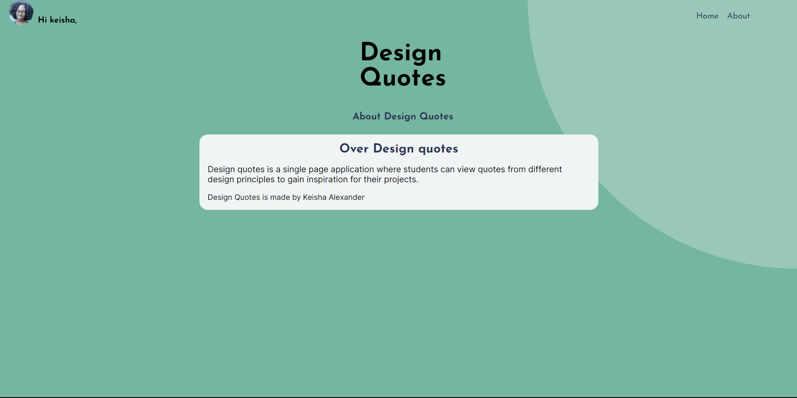

```javascript
// /routes/quotes.js
router.get('/about', (req, res) => {
    
    res.render('about', {
        title: 'About',
        pageTitle: 'About Design Quotes'
    });
    
})
```

```html
<!-- /views/about.ejs -->
<section id="about">

                <article>
                    <h2>Over Design quotes</h2>
                    <p>Design quotes is a single page application where students can view quotes from different design
                        principles to
                        gain inspiration for their projects.</p>

                    <p> Design Quotes is made by Keisha Alexander </p>
                </article>

            </section>

```
### Routes in de server toevoegen
Wanneer ik klaar was met de routes, heb ik het geëxporteerd op deze manier: `module.exports = router;`
En in mijn app.js heb ik een variabele `quotesRoter` gemaakt waarvan ik de router  inporteerde. Om de compontent te gebruiken heb ik de `app.use()` gebruikt. 

```javascript
var quotesRouter = require('./routes/quotes');
//An express zeggen om quotes.js bestand te gebruiken vor quotes router
app.use('/', quotesRouter);
```

---
## Build tools
Build tools automatiseert herhalende taken en optimaliseert de workflow wanneer de applicatie gedeployed is. Build tooling wordt gebruikt meestal :
- om javascript bestanden te verkleinen en minimaliseren. 
- Voor CSS preprossesor zoals Sass, less, Stylus.
- om  Afbeeldingen via een bron te laden
- Om HTML bestanden prerenderen

Tijdens mijn onderzoek ben ik tegen verschilldende build tools gekomen zoals webpack, grunt, browserfy, parcel, minifyjs, uglifyjs enz. Voor CSS had ik  verschillende preprocessors gevonden zoals SASS,LESS en Stylus. Uiteindelijk heb ik uglifyjs en SASS gekozen om verder mee te werken. Ik heb daarna  de build tool gekoppeld aan een NPM script. Ik ga nu stap voor stap uitleggen hoe ik had alles gedaan.

## Uglify.js
uglifyjs is een npm package waar je bestanden kan comprimeren, verkleinen en een verfraaien. Hier is een link naar de [documentatie](https://github.com/mishoo/UglifyJS) van uglifyjs.

### Installeren
Je installeert uglifyjs met `npm install` commando:
```
 npm install uglify.js
```  
 Ik heb die van mij in de devDependencies geplaatst met 
```
 npm install uglify.js --save-dev  
```
### Hoe gebruik je UglifyJs?
Om uglify te gebruiken, moet je de volgende commando in de terminal plaatsen.
```
uglifys [input bestand] [options]
```
Ten eerste zet je uglify naar voren en daarna bij `[input bestand]`zet je de bestande(n) die je wil minimaliseren. `[options]` zijn taken die je kan doen met de bestand die je wil minimaliseren. Er zijn verschillende keuzes. Het meest gebruikt zijn:
- -c --compress; bestand comprimeren
- -m --mangle
- -o --output <file>; Het geminimaliseerde uitgevoerde bestand. 

Er zijn verschillende soorten taken die je kan toevoegen. Om ze te bekijken moet je `uglifyjs -help` in de terminal intoetsen. 

### Build tools in npm scripts
Ik heb een paar build tool npm scripts gemaakt, zodat ik makkelijk mijn bestanden kan minimaliseren. Hieornder zie je een paar voorbeelden.

```json

"minify:server": "uglifyjs app.js -c -m -o app.min.js",
    "minify:routerFolder": "uglifyjs-folder ./routes -eo ./routes-output",
    "minify:routerOne": "uglifyjs-folder ./routes -o ./routes-output/routes.min.js",
    "minify:js": "uglifyjs-folder ./public/script -eo ./public/script-output/clientside.min.js"
```

Ik heb ten eerste een npm script gemaakt om de server te bundlen als het ooit groot wordt. De script hiervoor is `npm run minify:server`. Als ik dit commando uitvoert, wordt de verkleinde versie opgeslagen in een `app.min.js`. Verder heb ik een extra npm package geïnstalleerd: `uglify-folder`. Het zorgt ervoor dat alle bestanden in een bepaalde bestandmap apart wordt gecomprimeerd. Maar er is ook een mogelijkheid om alle bestanden in een bestandmap als in bestand opslaan. 

## SASS
Sass is een css preprocessor. Sass wordt gebruikt wanneer de css stylesheet groot wordt en moeilijk wordt om te behandelen. Het zorgt ervoor dat de css leesbaar blijft. Sass komt met verschillende functionaliteiten die niet te vinden is in normale css. Functionaliteiten zoals nesten,  mixins and inheritance.

### Sass installeren
Ik heb Sass in mijn terminal geïnstalleerd met npm.

    npm install sass --save-dev

Ik de package in mijn devDependencie geïnstalleerd. 


### Sass gebruiken
Om Sass te gebruiken moet je de bestand extensie zetten als`.scss`. Hierin kun je de functionaliteiten gebruiken. Daarna voer je een commando in, die ervoor zorgt dat de Scss bestand  wordt omgezet naar css want de browser kan alleen css lezen. De commando die ik moet uitvoeren is:


```npm
sass --watch style-test.scss output.css

```
Hiermee wordt de scss bestand compiled naar css met de bestandnaam output.css.

### Functionaliteit met sass

### Nesten
Elementen die bij elkaar horen kunnen genest worden onder een parent element. Hier is een voorbeeld vanuit mijn eigen project.

```scss
// styles.scss 
/**********/
/* HEADER */
/**********/
header {
    width: 100%;
    display: grid;
    align-items: end;
    position: relative;
    /* height: 30vh; */
    gap: 2em;

 section:nth-of-type(1) {
    display: flex;

    align-items: center;
    gap: .5em;
}

 section:nth-of-type(1) h1 {
    font-size: 1em;
    align-self: flex-end;
    /* color: var(--donker-blauw) */
}

 section:nth-of-type(1) img {
    width: 3em;
    height: 3em;
    aspect-ratio: 1;
}


}

```

---

## Maak de applicatie een Progressive Web App.
In de volegnde opdracht heb ik mijn applicatie omgezet in een progressive Web App(PWA). Dus ik zorgde ervoor dat ik mijn app kan  installeren via mijn browser naar mijn lokale computer. De voordelen van PWA zijn:
- Het is snel 
- De app kan offline gebruikt worden
- Je kan het installeren op de homescherm van je telefoon of desktop.
- Je krijgt push notificatie als iets in de achtergrond van de App is gebeurd


## Hoe maak ik de App een PWA/ installeerbaar
Om de App om te zetten in een PWA moet je de volgende dingen hebben namelijk,
- HTTPS
- Service Worker
- Manifest.json bestand


### Dev tools in Chrome

### Applicatie tab
In Chrome als je op de applicatie tab gaat kun je bekijken of er wel een manifest.json bestand in het project te vinden is. Ook kun je informatie vinden over de server worker en cache enz. 

### Lighthouse
In de lighthouse tab ga de browser je applicatie beoordelen of je bepaalde criteria behaald zoals seo, toegankelijkheid, performance, Best practices en Progressive Web App. Als je bepaalde criteria niet voldoet dan krijg  je oplossingen om die te verbeteren.

---

## Manifest.json
De Manifest bestand is een json bestand met bepaalde informatie die je moet invullen voor de PWA. Het verteld de browser hoe de app moet gedragen als die geïnstalleerd is.

### Hoe maak je een manifest bestand?
Ten eerste maak je een bestand in de root van het project. Mijn applicatie is server-side gerendered dus ik heb die van mij in de root gezet van de public bestandmap. Verder heb ik een bestand gemaakt die heet `manifest.json`. In de Manifest.json heb je een aantal object properties. 
Properties die je tenminste moet hebben in je manifest bestand zijn:
- `short_name` - Korte naam van de applicatie
- `name` - Volledige naam van de applicatie
- `icons` - de thumbnail die je ziet bij de homescherm
- `display`, hoe die moet eruit zien. (standalone, fullscreen, minimal-ui)


```json
// manifest.json
{
    "name": "Design Quotes for students", //volledige app naam
    "short_name": "Design Quotes", //korte app naam
    "start_url": "/", //waar de pagina begint 
    "scope":"/",
    "display":"standalone",
    "background_color": "#75B6A2", //kleur van bar bovenaan
    "theme_color": "#75B6A2", //achtergrond kleur wanneer de app offline is
    "orientation":"portrait-primary",
    "icons": [] //iconen voor de app


```
## Manifest bestand verbinden
Om de manifest bestand te koppelen aan de app moet je die zetten in de `<link>` van je html pagina's.
```html
 <link rel="manifest" href="/manifest.json">
```
Als je naar de Applicatie tab in je browser gaat, dan kun je de informatie die je hebt ingevuld in het manifest bestand terug zien.

---

## Service Worker
Het volgende stap om mijn prototype een progressive web app te maken, heb ik een service worker geïnstalleerd. Voordat ik aan het werk ging, heb ik een Job Story bedacht om een richtlijn te krijgen van de stappen die ik moet nemen. 

### Job Story
> Wanneer ik in de trein zit en geen goed internetverbinding hebt, wil ik alsnog de lijst met citaten zien, zodat ik onderweg nog steeds inspiratie kunnen krijgen voor mijn schoolprojecten. 


## Wat is een service worker?
Service workers gedragen als een proxy server tussen de web applicatie, de browser en de network(met verbinding).
 Hun taak zijn:
- Een goed offline ervaring te creëren.
- Kijken naar request en reponse tussen de server en de client.
- Geef toegang voor push meldingen.


### Kenmerken van een service worker
- Het is een web API
- Het is geschreven met javascript
- Werkt in de achtergrond
- Staat in een aparte lijn ten opzichte de server en de client
- Het is event gebasseerd
- Heeft geen toegang tot Document Object Model
- Kan geen javascript modules importeren
- Ze draaien alleen op HTTPS vanwege beveiliging. 


## Hoe werkt de Service worker?

### Stap 1: Service worker bestand maken
Ik heb in de root van mijn public bestand, de `sw.js`, bestand gemaakt. Als ik niet server side hoefde te werken, moest ik gewoon in de root van mijn applicatie werken. 

### Stap 2: Service worker registreren 
Verder moet je de service worker registreren, zodat de browser weet dat dit web app een service worker bevat. Wat ik heb gedaan is een partials bestand `script-tag.ejs `gemaakt met daarin de registratie script. Vervolgens heb ik met de `include()` methode deze stukje code in al mijn pagina's geplaatst.

```html
<script>
    if('serviceWorker' in navigator){
        navigator.serviceWorker.register('/sw.js')
        .then((reg) => console.log('Service worker registered', reg))
        .catch((err)=> console.log('Service worker not registered', err))  
    }   
</script>
```
Deze functie stuurt een bericht naar de console dat die geregistreerd is. IK geef aan welke bestand de service worker is. 


### Onderdelen van de service worker
Een service worker is event gebaseerd. Het bestaat uit drie events, de install event, de activate event en de fetch event. In de install event wordt de service  worker geïnstalleerd. Hier wordt ook de precaching gedaan. Verder heb je de activate event,hier wordt de service worker geactiveerd en klaar gemaakt om request en response te nemen. En Als laatste heb je de fetch event. In deze event wordt de opgeslagen data opgehaald en gerendered op de pagina of gaat terug naar de offline fallback pagina.

### Stap 4: Service worker bestand opstellen

### Precaching install event
De precaching  wordt gedaan in de install event. Ik heb twee constante variabele. De `CORE_CACHE_NAME` is de versie naam van de service worker/cache en de `CORE_ASSETS` zijn de statische bestanden die ik van te voren wil cachen zodat die beschikbaar zijn wanneer de gebruiker geen internet verbinding heeft. Statisch bestanden zijn vooral css, client-side javascript, fonts enzovoorts. 

```javascript
const CORE_CACHE_NAME = 'cache-v1';
const DYNAMIC_CACHE_NAME ='dynamic-cache-v1';
const CORE_ASSETS = [
    '/',
    '/offline',
    '/css/style.css',
    'https://fonts.googleapis.com/css2?family=Gloock&family=Inter:wght@300;400;700&family=Josefin+Sans:wght@300;400;500;700&display=swap',
    'https://fonts.gstatic.com/s/gloock/v1/Iurb6YFw84WUY4NJhRakNrc.woff2',
    'https://fonts.gstatic.com/s/inter/v12/UcC73FwrK3iLTeHuS_fvQtMwCp50KnMa2JL7SUc.woff2'  
];

// install service worker
self.addEventListener('install', event => {
    console.log('service worker has been installed');
    event.waitUntil(
        caches.open(CORE_CACHE_NAME)
        .then(cache =>cache.addAll(CORE_ASSETS))
         .then(() => self.skipWaiting())
    );   
});
```
- `skipWaiting()`
- `waitUntil()`
- `self` is de service worker zelf
  
### Serve from cache met fetch event
Met de fetch event haal ik de data uit de cache. Dus wanneer de gebruiker de pagina benadert wordt de url ogeslagen in de `DYNAMIC_CACHE_NAME`. Dus wanneer er geen internetverbinding is het offline mogelijk om de pagina's te gebruiken. Bij de niet opgeslagen url is het onmogelijk om de pagina te gebruiken als je offline bent. In dit geval krijgen de gebruiker een offline fallbackpagina
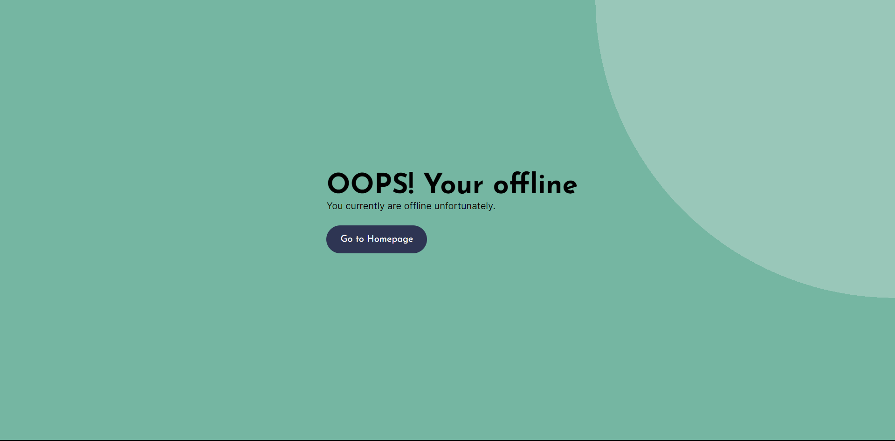.

```javascript
self.addEventListener('fetch', event => {
   event.respondWith(
    caches.match(event.request).then(cacheRes =>{
        return cacheRes || fetch(event.request)
        .then(fetchRes => {
            return caches.open(DYNAMIC_CACHE_NAME)
            .then(cache => {
                cache.put(event.request.url, fetchRes.clone());
                return fetchRes;
            })
        });
    }).catch(() =>{
        if (event.request.headers.get('accept').includes('text/html')) {
            return caches.match('/offline')
        }
    })
   );
    console.log('fetch event', event);
});

```

### Cache verschonen met het activate event 
In de activate wordt de server worker geactiveerd wanneer het klaar is met installeren. Ik heb een functie geschreven waar oude cache versie verwijdert wordt en door het nieuwe verplaatst worden. Hieronder staat mijn code:

```javascript
self.addEventListener('activate', (event) => {
    event.waitUntil(
        caches.keys()
            .then(cacheNames => {
                return Promise.all(
                    cacheNames.map(cacheName => {
                        if (cacheName !== CORE_CACHE_NAME && cacheName !== DYNAMIC_CACHE_NAME) {
                            return caches.delete(cacheName);
                        }
                    })
                )
            })
    )

```
Als de oude caches niet matchen dan wordt de oude versie verwijdert.

## Activity Diagram van de Service worker
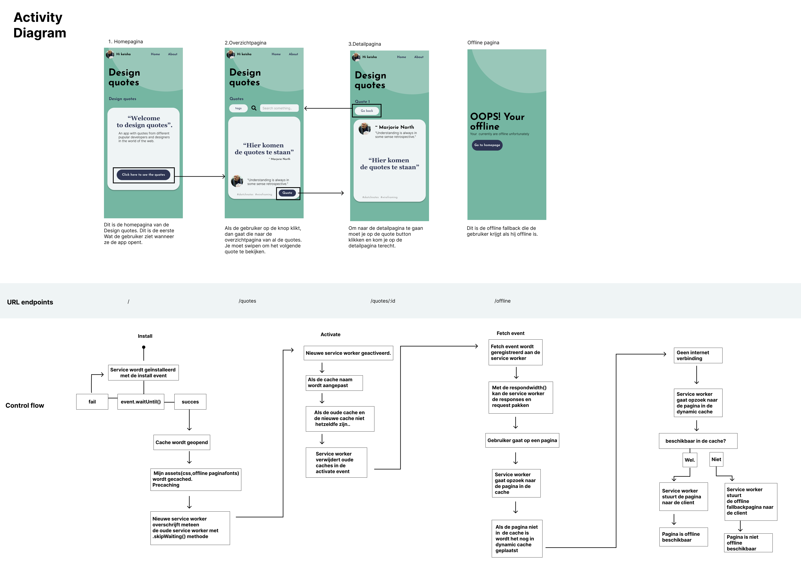

Dit is mijn activity diagram voor de service worker. Het diagram bestaat uit, een wireflow van de applicatie. De url endpoints van de applicaties. Onderaan heb je de control flow dus de belangrijkste onderdeel van de activity diagram. Met de activity diagram laat ik  visueel zien hoe de service worker werkt.

---
# Critical rendering path
Wat is critical rendering path?  De critical rendering path verwijst naar het proces van het weergeven van een webpagina in de browser, vanaf het moment dat de gebruiker een URL invoert totdat de pagina volledig is geladen. Het optimaliseren van de critical rendering path is belangrijk omdat het de laadtijd van een pagina beïnvloedt, wat op zijn beurt van invloed kan zijn op de gebruikerservaring en zoekmachine ranking.

Om de critical rendering path te optimaliseren, zijn er verschillende technieken en best practices die kunnen worden geïmplementeerd. Enkele voorbeelden hiervan zijn:
- Code Minimaliseren
- Bestanden comprimeren
- Optimaliseer afbeeldingen door ze te comprimeren, het gebruik van afbeeldingsformaten te optimaliseren en afbeeldingen te schalen naar de juiste afmetingen.
- Gebruik asynchrone laadtechnieken: Het gebruik van asynchrone laadtechnieken zoals lazy loading en het laden van scripts aan het einde van de pagina kan de laadtijd verbeteren.

### Hoe kon ik de performance van me applicatie testen? 
Om de performance van de app te testen, heb ik de dev tools in de browser gebruikt. De eerste is lighthouse. Lighthouse maakt een analyse en geef je een score terug. Onderaan zijn er bepaalde criteria's die je moet voldoen om de performance te verhogen. Het volgende functionaliteit is de netwerk tab, hier kan je informatie vinden van je http request. Het laatste onderdeel is de applicatie tab, hier zijn de browser API's. Voor deze vak moest ik alleen kijken, bij de manifest, Service Worker en de Cache Storage. 


## Hoe heb ik de critical rendering path beter gemaakt? 
Voor mijn critical rendering path wil ik de percieved load speed optimaliseren en de runtime responsiveness. 
Om de critical rendering path te verbeteren en optimaliseren, heb ik een aantal dingen gedaan:

### 1. CSS minimaliseren
De eerste wat ik heb gedaan is de css, minimaliseren. Ik heb een plugin van vscode gebruikt. Maar de plugin is hetzelfde als de build tool van uglifyjs. Wat dit doet, is het haal alle witruimte en zet alle css properties op een lijn. 
Ik heb een voorbeeld laten zien van mijn prototype met en zonder geminimaliseerde css.

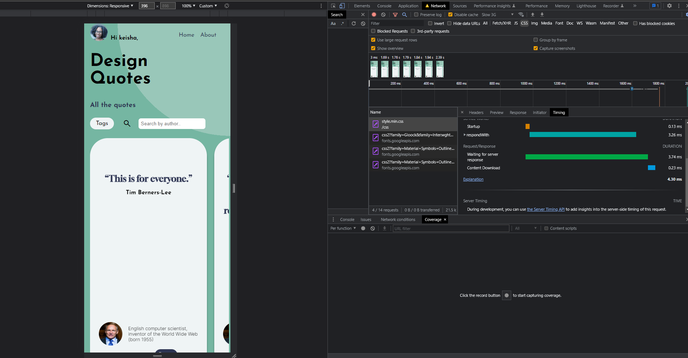
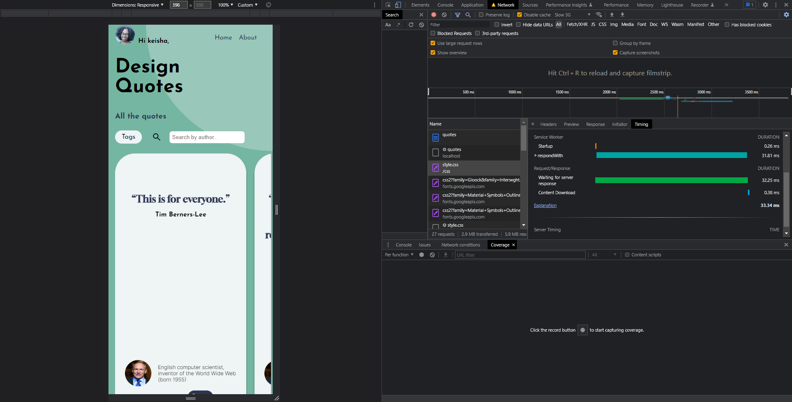


### 2. HTML minimaliseren
Om de html te minimaliseren heb ik gebruikt gemaakt van express-minify-html. Het is een express middleware die je in de express server kan toevoegen met de `app.use` methode. Verder kun je bepaalde opties geven die hij moet rekening houden tijdens het minimalisatie. Hier is de code die ik heb daarvoor gebruikt. 

```javascript
const minifyHTML = require('express-minify-html');

app.use(minifyHTML({
    override: true,
    exception_url: false,
    htmlMinifier: {
        removeComments: true,
        collapseWhitespace: true,
        collapseBooleanAttributes: true,
        removeAttributeQuotes: true,
        removeEmptyAttributes: true,
        minifyJS: true
    }
}));

```
### Lazy Loading voor afbeelding
Mijn prototype gebruikt veel afbeeldingen en lazy loading zorgt ervoor dat de afbeeldingen niet meteen geladen wordt maar wanneer het echt noodzakkelijk is. Wat ik heb gedaan is bij de `` heb ik de `loading="lazy"` atribuut geplaatst. Het zorgde ervoor dat de pagina snel laad. In mijn applicatie zijn de citaten het belangrijkste content  en niet de afbeeldingen. Dus als die later geladen wordt is het niet erg. 


### Afbeelding verkleinen
Een andere oplossing is de grootte van de afbeelding te verkleinen. Voor mij kan het makkelijk, want ik kan direct mijn api aanpassen. De afbeeldingen in de API zijn links vanuit verschillende websites. Dus ik heb per afbeelding de originele afbeelding link gevonden. Hierin kan je de ook de grootte zien. Ik heb de afmetingen in de link kleiner gemaakt. Meeste afbeelding waren groot dus in de netwerk tab duurt het even zodat ze gerendered zijn. Maar door die kleine aapassingen werd iets sneller. Hieronder is een voorbeeld:


### Font subsetting
Ik heb custom fonts van google fonts gebruikt in mijn app. Deze lettertypes zijn belangrijk want het onderscheid de type informatie die ik wil aan de gebruiker laten zien. 
Toen ik mijn app teste, heb ik gemerkt dat voordat het pagina geladen wordt, kon je de fonts niet zien. Als er iemand de app zou gebruiken met een trage apparaat en internetverbinding, dan kunnen ze de app meemaken zonder lettertype. Dit fenomeen heet de foit (Flash of invisible text). Om foit te voorkomen moest ik de css property `@font-face` gebruiker per lettertype met daarbij `font-display: swap`.

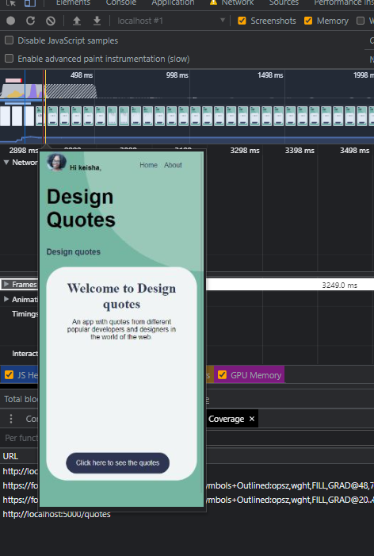

Ik heb dus de google fonts geïnstalleerd en in fontsquirrel een webfont ervan gemaakt. Verder heb ik de fonts in de font-face property geplaats met de font-display.

Want het doet is voordat de pagina klaar is met laden, wordt eerst de systeem fonts gerendered en nadat de pagina wordt geladen wordt de systeem fonts omgewisseld (swap) met de custom fonts.

```css

@font-face {
    font-family: 'Josefin Sans';
    src: url(../fonts/josefinsans-bold-webfont.woff2) format(woff2);
    font-display: swap;
}

@font-face {
    font-family: 'Josefin Sans Regular';
    src: url(../fonts/josefinsans-regular-webfont.woff2) format(woff2);
    font-display: swap;
}

@font-face {
    font-family: 'Gloock';
    src: url(../fonts/gloock-regular-webfont.woff2) format(woff2);
    font-display: swap;
}

@font-face {
    font-family: 'Inter';
    src: url(../fonts/inter-variablefont_slntwght-webfont.woff2) format(woff2);
    font-display: swap;
}

```
Dit is het resultaat nadat ik dit heb gedaan.
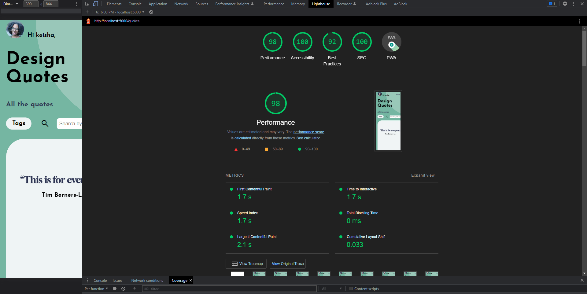

### Caching control
Caching control is een methode die wordt gebruikt om de cache-instellingen van een webpagina of een ander bestand op een webserver te beheren. Wanneer een browser een webpagina bezoekt, wordt een kopie van de pagina opgeslagen in de cache van de browser om de laadtijd van toekomstige bezoeken aan die pagina te versnellen...

De code die ik hiervoor had gebruikt:
```javascript
let options = { maxAge: '2y' }
app.use(express.static('public', options))
```
---
## Applicatie online zetten
De laatste onderdeel voor dit opdracht is de app online zetten. Hiervoor heb ik een online webserver gebruikt  die mijn webapp kan hosten. Ik heb `railway.app` gebruikt. Met railway kan ik mijn github account koppelen en elke keer dat ik commit wordt het ook op railway aangepast. 

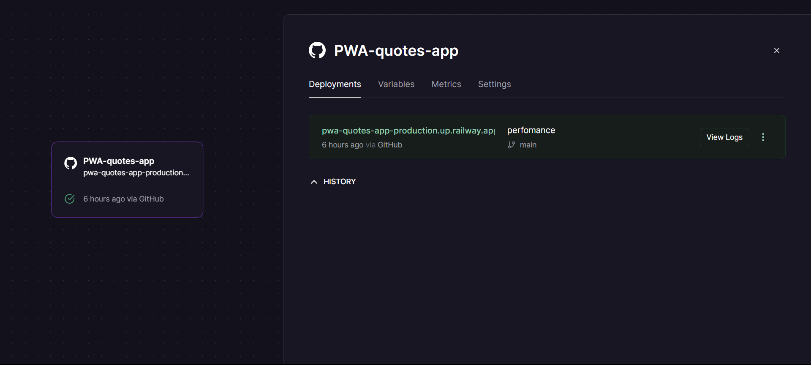

### Hoe gebruik je railway
1. Npm Script in je package.json moet zo zijn: `" start": "node app.js"`
2. Railway account maken met je github account
3. Nieuwe account instellingen doen
4. Repository kiezen
5. Nieuw project aanmaken
6. Domeinnaam genereren in de instellingen
7. Bij Variabele de PORT en PORT NUMMER toevoegen

---
## Bronnen
- Sass: Sass Basics. (z.d.). https://sass-lang.com/guide
- The Net Ninja. (2019b, mei 6). PWA Tutorial for Beginners #1 - What Are PWA’s? [Video]. YouTube. https://www.youtube.com/watch?v=4XT23X0Fjfk
- Service Worker API - Web APIs | MDN. (2023, 13 maart). [Video]. https://developer.mozilla.org/en-US/docs/Web/API/Service_Worker_API
- Why does speed matter? (2019, 1 mei). [Video]. web.dev. https://web.dev/why-speed-matters/
- font-display - CSS: Cascading Style Sheets | MDN. (2023, 21 februari). [Video]. https://developer.mozilla.org/en-US/docs/Web/CSS/@font-face/font-display
- Critical rendering path - Web performance | MDN. (2023, 24 februari). . https://developer.mozilla.org/en-US/docs/Web/Performance/Critical_rendering_path
- M. (z.d.). GitHub - mishoo/UglifyJS: JavaScript parser / mangler / compressor / beautifier toolkit  GitHub. https://github.com/mishoo/UglifyJS#readme
- manifest.json - Mozilla | MDN. (2023, 7 maart). . https://developer.mozilla.org/en-US/docs/Mozilla/Add-ons/WebExtensions/manifest.json
- Getting Started Guide | Node.js. (z.d.).  Node.js. https://nodejs.org/en/docs/guides/getting-started-guide/
- Installing Express. (z.d.-b). http://expressjs.com/en/starter/installing.html
- Progressive Web Apps The future of Mobile Web - Awwwards. (z.d.). https://www.awwwards.com/PWA-ebook/en
- Judis, S. (2021, 17 januari). The state of PWAs (progressive web apps) in 2020/2021. Stefan Judis Web Development. https://www.stefanjudis.com/notes/the-state-of-pwa-adoption-in-2020-2021/
- Service worker overview - Chrome Developers. (2021, 24 september). Chrome Developers. https://developers.google.com/web/fundamentals/primers/service-workers
- web.dev. (z.d.). Progressive web Apps. https://web.dev/progressive-web-apps/
- The Offline Cookbook. (2014, 9 december). web.dev. https://web.dev/offline-cookbook/
- Why does speed matter? (2019b, mei 1). web.dev. https://web.dev/why-speed-matters/
- Lighthouse overview - Chrome Developers. (2016, 27 september). Chrome Developers. https://developer.chrome.com/docs/lighthouse/overview/
- Veerapathirathasan, V. (2023, 15 maart). How to install Node.js and npm using Node Version Manager (NVM). Medium. https://medium.com/@iam_vinojan/how-to-install-node-js-and-npm-using-node-version-manager-nvm-143165b16ce1
- EJS -- Embedded JavaScript templates. (z.d.). https://ejs.co/
- Kandut, M. (2022, 6 januari). What are NPM scripts? - Mario Kandut - Medium. Medium. https://medium.com/@mariokandut/what-are-npm-scripts-cde15d275a9f
- npm: uglify-js. (z.d.). npm. https://www.npmjs.com/package/uglify-js
- freeCodeCamp.org. (2021, 28 april). CSS Preprocessors Explained. https://www.freecodecamp.org/news/css-preprocessors/
- WebStylePress. (2022, 3 juni). MINIFY JAVASCRIPT FILES & FOLDERS in Multiple Ways (Command Line & Code Editor) [Video]. YouTube. https://www.youtube.com/watch?v=umVoV4ak0HA
- Add a web app manifest. (2018, 5 november). web.dev. https://web.dev/add-manifest/?utm_source=devtools
- manifest.json - Mozilla | MDN. (2023b, maart 7). https://developer.mozilla.org/en-US/docs/Mozilla/Add-ons/WebExtensions/manifest.json
- npm: express-minify-html. (z.d.). npm. https://www.npmjs.com/package/express-minify-html
- Coyier, C. (2022, 30 september). How to use @font-face in CSS | CSS-Tricks. CSS-Tricks. https://css-tricks.com/snippets/css/using-font-face-in-css/
- font-display - CSS: Cascading Style Sheets | MDN. (2023b, februari 21). https://developer.mozilla.org/en-US/docs/Web/CSS/@font-face/font-display
- CSS performance optimization - Learn web development | MDN. (2023, 4 maart). https://developer.mozilla.org/en-US/docs/Learn/Performance/CSS
- CSS performance optimization - Learn web development | MDN. (2023b, maart 4). https://developer.mozilla.org/en-US/docs/Learn/Performance/CSS
- The performance effects of too much lazy loading. (2021, 15 juli). web.dev. https://web.dev/lcp-lazy-loading/
- 